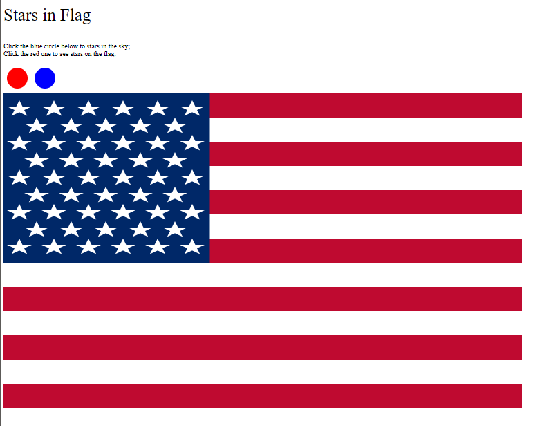
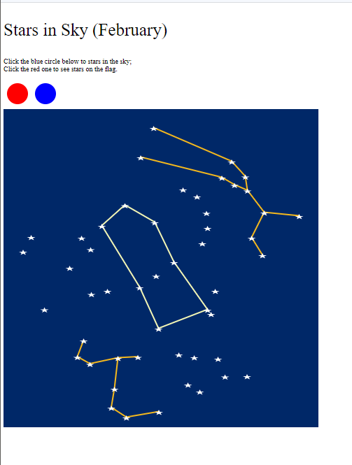

# Assignment 1 - Stars: GitHub and d3  

Website: [masun77.github.io/01-ghd3](masun77.github.io/01-ghd3)

### Description

This webpage runs on Github Pages. It uses HTML, JavaScript, and the d3 library to generate circles, rectangles, lines, and polygons in different colors at different locations around the screen.

The website can show two graphics. One is the American flag, one is part of the night sky 
that's visible in the northern hemisphere in February. Screenshots are shown below:

There are 2 circles: red and blue. Clicking the blue circle shows the night sky; clicking the red circle shows the American 
flag. Rectangles are used to form the American flag stripes and the background for the sky. The lines point out some constellations that are visible right now; mousing over a constellation line will make its name show up in the text at the top of the page. The polygons are the stars in both the flag and sky. I experimented a bit with paths, but didn't end up putting any on here.

#### Technical Achievements

I learned the basics of HTML and JavaScript and used them to make a website! This is my first time
programming a website, so I completed the first few units of CodeAcademy's
HTML and JavaScript courses and experimented from there. I learned a lot as I went along, including the following:
- Shapes can be appended to the document or the SVG in a variety of ways, including manually entering them, 
using a for loop to create them, and using the d3 data binding. I used a for loop to create
  the stars in the flag and a d3 binding to create
  the stars in the sky. 
  - If I were to do this again, I would further condense the for loop. But I'm not sure switching to a d3 
  binding for such repetitive/structured data would be necessary; I'll have to look into this more. I would also 
    improve the bindings for the constellations - right now I run a loop to bind each constellation
    separately, but I could probably find a way (perhaps nesting information) to bind them with fewer lines of code.
- I used another .html file to make location picker for the stars. Stars.html allows you to click within a rectangle
and displays the location of the mouse at that click (and sets down a star). I then copy-pasted those
  locations to use as data for the webpage. 
  - If I were to do this again, I would print the information in a nicer format or find some other way to store it 
    (perhaps I need a server-side to save data into files) so that it's easier to convert to data for d3. 
- Big things I would do differently on the process side are learning how
JavaScript files are divided (e.g. into functions, scripts, files) to make the code
  more legible, and improving my JavaScript/html writing and debugging workflow to catch errors earlier and not be duped 
  when refresh doesn't show the changes I thought I made. 

### Design Achievements

- I used the formal colors and dimensions of the American flag, which took some calculations. If I were
to do this again, I would program in the dimensions as constants and then use them, and simplify the for loops I made to 
create the shapes. 
- I used a mix of colors like 'red' and RGB values; doing this again I would pick my colors more carefully
and make sure they work for people who are color blind. (Which makes me wonder, how do visualizations deal with people who use text-to-speech for websites?
I.e., how much do concern do people designing visualizations take for people who are blind
or low of sight - or is this simply not the intended audience?) 
- I kept the layout easy to navigate, and slightly interactive. My goal had been to animate things - e.g.,
allow the user to hover over constellations to see more information, to be able to sort the stars
  by brightness or distance, and to have the stars move from one graphic to the other. I would add these features once I 
  know more and am able to make them, which requires getting to know d3 a lot better. It 
  also makes me think that the way you structure your data and webpage from the start
  can make it easier or harder to make it animated/interactive later on, so that's something
  I'll think about for the next projects. 

### Sources:
I based sections of my code on the code from CS 480X (lecture notes from 1/28/21). I used a lot of internet pages to 
find out what functions are available in JavaScript. For example, I used w3schools.com to find out how to select
 substrings in JavaScript and how to draw lines, and I used stackoverflow.com to find out how to draw polygons. 
I used a February sky map from The Old Farmer's Almanac to pick approximate star positions. 
The American flag dimensions are based on the dimensions provided by InchCalculator.com. I used htmlcolorcodes.com/color-picker to pick RBG values. 

